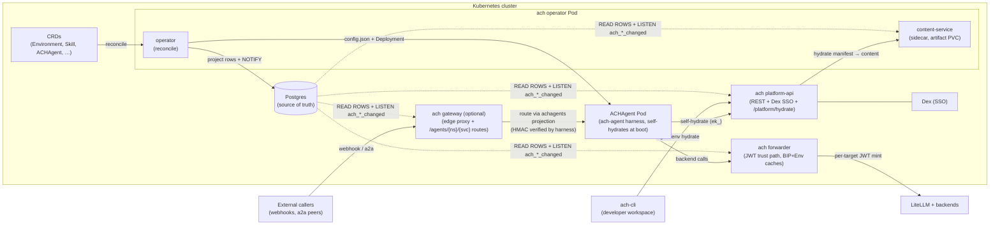

# ACH — Agent Capability Hub

Multi-service Kubernetes control plane for managing AI agent configurations:
operator + platform API + forwarder + content service + CLI. The long-running
services ship as a single Go binary (`ach`) with cobra subcommands; the
user-facing CLI ships as a separate `ach-cli` binary (login/whoami/logout/
config/env/keys/hydrate/admin).

## Quick start

Once the Hub is deployed and reachable at `https://ach.local.test` (the
standard kind+Helm fixture host — see `deploy/helm/ach/values.yaml` for
the `ACH_BASE_URL` default and `examples/04-environment-demo.yaml` for
the `demo` Environment the example uses):

```bash
ach-cli login                                  # one-time device-code SSO
ach-cli env hydrate demo > hydrate.json
```

The `hydrate.json` byte output reproduces `examples/hydrate.json`
verbatim against the standard fixture cluster (modulo platform-api
host substitution; the CLI e2e suite normalizes this automatically —
see `test/e2e/cli_login_hydrate_test.go`). See `examples/README.md`
for the full demo walkthrough.

## Architecture



## Quick links

- [Documentation](https://ackstorm.github.io/ach/)
- [Installation](https://ackstorm.github.io/ach/getting-started/installation/)
- [Architecture](https://ackstorm.github.io/ach/developer-guide/architecture/)
- [Release process](https://ackstorm.github.io/ach/developer-guide/release-process/)
- [Operator contract](https://github.com/ackstorm/ach-agent/blob/main/docs/schemas/operator-contract.md) — the frozen seam with the `ach-agent` harness, and its [JSON Schema](https://github.com/ackstorm/ach-agent/blob/main/docs/schemas/agent-config-v1.schema.json) (vendored here as `internal/agentrender/testdata/agent-config-v1.schema.json`, drift-guarded by `TestSchema_NoDrift`)
- [CONTRIBUTING](CONTRIBUTING.md)
- [SECURITY](SECURITY.md)
- [MAINTAINERS](MAINTAINERS.md)
- [CHANGELOG](CHANGELOG.md)

## License

Apache-2.0 — see [LICENSE](LICENSE) and [NOTICE](NOTICE).
