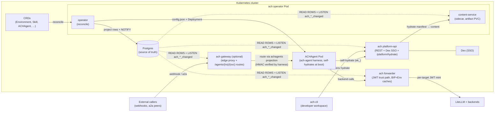

# ACH — Agent Capability Hub

**Project specification & technical review brief**
Version reviewed: v0.6.10 · Date: 2026-07-13 · Audience: CTO / CIO / CEO + engineering

---

## 1. Executive summary

ACH (Agent Capability Hub) is a Kubernetes-native control plane for **declarative, governed configuration of AI agents**. It gives an organization one place to define what an AI agent (or a developer's AI tooling) is allowed to use — models, MCP servers, A2A peers, prompts, skills, artifacts, credentials — and delivers that configuration to two consumption surfaces:

1. **Developer workspaces** — a developer runs `ach-cli login` + `ach-cli env hydrate` and their local AI tools (Claude Code, Gemini CLI, Codex, OpenCode) are configured with exactly the models, keys, and skills their team is authorized for.
2. **Running agents** — an `ACHAgent` custom resource deploys a long-running agent (webhook-, cron-, or queue-driven) that self-configures against ACH at boot and is reachable through a governed gateway.

The business problem: AI usage inside companies is exploding with zero governance — every developer pastes API keys into local config, every team wires its own agents, nobody can answer "who can use which model, with which data, at what cost." ACH answers that with GitOps: capabilities are declared as Kubernetes resources, reviewed in pull requests, reconciled by an operator, and audited centrally. Cost and access control ride on LiteLLM (virtual keys, teams, budgets); identity rides on the company SSO (Dex/OIDC).

Positioning in one line: **"IAM + package manager + fleet manager for AI agents, GitOps-native."**

---

## 2. What exists today (shipped, v0.6.10)

| Capability | Status |
|---|---|
| Declarative capability model (11 CRD kinds; 9 shipped in the chart, 2 plugin kinds gated off) | ✅ shipped |
| SSO login → personal key (`pk_`) minting via LiteLLM | ✅ shipped |
| Environment hydration into 4 local AI tools (multi-target) | ✅ shipped |
| Environment-scoped service keys (`ek_`) with revocation + audit | ✅ shipped |
| Skills: standalone CRs + marketplace discovery (agentskills.io convention) | ✅ shipped |
| Local-first package manager (`ach-cli repo` / `skill`) — no cluster needed | ✅ shipped |
| JWT-minting forwarder (per-backend identity, no static keys at rest in agents) | ✅ shipped |
| Agent fleet: `AgentProfile` + `ACHAgent` → self-booting harness Deployments | ✅ shipped |
| Gateway with opt-in per-agent routes (webhooks / a2a) | ✅ shipped |
| Admin surface: object inventory, key lifecycle, runtime catalog | ✅ shipped |
| UI write path (Environment drafts, GitOps-wins takeover) | ✅ v1 (Environment only) |
| Plugins / PluginMarketplace | ⏸ built, feature-gated OFF (`featuregate.PluginsEnabled=false`) |
| Release pipeline (goreleaser, Helm chart, signed multi-service image) | ✅ shipped |

Scale of the codebase: ~146k lines of Go across operator, platform API, forwarder, content service, gateway, and two binaries; 18-gate pre-push publication check; unit + envtest in CI, full e2e (kind + Helm) as a local merge gate.

---

## 3. Architecture

### 3.1 Topology

- **One Go binary, five logic modes** (`ach operator|platform-api|forwarder|content-service|migrate`), each an independent Helm Deployment sharing one image. A sixth mode, `gateway`, is an optional logic-free edge proxy that also serves opt-in per-agent routes.
- **Separate `ach-cli` binary** for end users (drops all k8s dependencies): login/keys/env/admin/runtime + the serverless local package manager.
- **Postgres is the source of truth** for all non-operator reads. The operator projects CRD state into 13 projection tables (3 more — personal/environment keys, runtime catalog — are platform-api-owned) and emits `NOTIFY ach_*_changed` in the same transaction; platform-api, forwarder, content-service, and gateway read rows and LISTEN — no service except the operator reads CRDs. This decouples the read path from the k8s API server (performance, blast radius) and is the foundation for the UI.
- **Content service** streams artifact/skill tarballs via `sendfile(2)`; runs as an operator-Pod sidecar by default (RWO cache PVC) with an optional standalone N-replica mode for HA (requires RWX storage).
- **Design scale envelope**: a single-cluster, single-org control plane — on the order of hundreds of developers and tens-to-hundreds of Environments/agents, with content objects in the tens of MB. The sidecar content-service is sized for this envelope; the standalone RWX mode exists only for deployments beyond it.

### 3.2 Resource model (CRDs, `ach.ackstorm.ai/v1alpha1`)

| Kind | Role |
|---|---|
| `Environment` | The governed unit: models + MCP servers + A2A agents + context (prompts, artifacts, skills) + authorized teams. Two-axis status: `ExecutionResourcesResolved` + `AccessGroupSynced` → composite `Available`. |
| `Skill` / `SkillMarketplace` | Content kinds: a SKILL.md directory (fetched, validated, packaged as tar.gz) / convention-based discovery over a git monorepo. |
| `Prompt`, `Artifact` | Additional context objects, fetch-narrowed by `spec.path`. |
| `LiteLLMConnection` | Singleton (`default`) per namespace: the LiteLLM endpoint + admin credential Environments resolve against. |
| `BackendIdentityPolicy` | Per-target JWT identity the forwarder mints — agents never hold long-lived backend credentials. |
| `AgentProfile` / `ACHAgent` | Reusable infra template + agent instance → rendered `agent-config-v1`; the harness self-hydrates at boot. Explicit, narrow override set (model, limits, ach.baseUrl, health). |
| `Plugin` / `PluginMarketplace` | Fully built, currently gated off — a deliberate scope decision, reversible with one const + `make helm-sync`. |

That is 11 kinds; the chart ships 9 (the 2 plugin kinds are gated off). **Not
CRDs** (a common confusion): personal keys (`pk_`) and environment keys (`ek_`)
are platform-api/DB objects with REST lifecycle; teams live in LiteLLM + the
runtime catalog; the gateway route set is the `achagents` DB projection the
operator writes.

### 3.3 Security model (summary)

- **Identity**: Dex/OIDC SSO → `provisionUser` → LiteLLM virtual key. Personal keys (`pk_`) and environment keys (`ek_`) with distinct scopes; revocation is idempotent and audited.
- **Backend access**: forwarder mints short-lived per-target JWTs from `BackendIdentityPolicy` — cached in-memory, refreshed via LISTEN/NOTIFY + periodic resync. Agents authenticate to LiteLLM with the caller's own virtual key.
- **Agent secrets**: inbound channel-auth secrets injected as env vars via `secretKeyRef`, never file-mounted. The honest rationale is operational: no secret material on the pod filesystem/PVC and a simpler harness contract (read env at boot, no volume plumbing). It is **not** an isolation boundary — a same-uid process can read `/proc/<pid>/environ` just as it could read a mounted file. Config-hash rolling is salted.
- **Supply chain**: 18-gate pre-push (gitleaks, trufflehog, SPDX headers, govulncheck with an explicit acknowledged-list, large-file and sensitive-pattern checks); pinned toolchain in a devtools container.
- **Trust boundaries**: gateway is deliberately auth-free (agents verify HMAC themselves); content service enforces team-based authz per request with a closed error vocabulary and one audit event per request.
- **Rate limiting**: not the gateway's job — inbound abuse absorption belongs to the Ingress/edge in front of it (out of scope for ACH), and model-cost limits ride on LiteLLM budgets per key/team.

### 3.4 Engineering practices worth showing off

- Single-binary multi-mode design keeps the image surface and release pipeline trivial.
- Docs-as-contract: CLAUDE.md navigation hub + mandatory reading tables + same-commit doc hygiene rule; drift is treated as a bug.
- Two ponytail (over-engineering) audits executed (2026-07-03, 2026-07-13) — the codebase is measurably near its floor; the 07-13 audit found ~600 removable lines out of 146k, mostly non-production scaffolding.
- Everything runs through a devtools container (host needs only Docker); banned-pattern discipline (no naked polling loops, blessed `wait-*` targets).

---

## 4. Known gaps & accepted trade-offs (honest list for the review)

1. **E2E is not a CI gate** — removed from CI for cost/speed; the burden is a local `make e2e-full` before merge. Works with discipline, doesn't scale with team size.
2. **No branch protection on `main`** — PR-only CI is a real gate only with branch protection (paid plan / public repo). Direct pushes are currently unguarded.
3. **Hydrate vs concurrent editor save race** — a user edit during the hydrate window can be silently lost (self-heals next hydrate). Accepted v1 trade-off; an mtime-recheck would close it.
4. **Environment authoring is admin-only** — no per-object ACLs yet, so no team self-service for Environments. Deliberate (avoids inventing an ACL model prematurely).
5. **UI write path is Environment-only (v1)** — the Objects API + GitOps-wins takeover pattern exists but covers one kind.
6. **Content-service HA requires RWX storage** — default sidecar mode is single-point for content serving (operator restart = brief unavailability; clients retry).
7. **Plugins gated off** — code, tables, and reconcilers are maintained but dormant; carrying cost is nonzero (docs, tests, mental overhead) and should be periodically re-justified.
8. **LISTEN/NOTIFY is at-most-once** — mitigated by 5-minute periodic refresh; worst-case staleness window is bounded but real.
9. **Kustomize install surfaces are unsupported; Helm is the only working path.** `deploy/kustomize/` was deleted 2026-07-17 (decision taken: Helm-only). `config/` remains, but as build/test scaffolding — `config/crd/bases` feeds envtest and `helm-sync`, and `config/default` is applied by the e2e suite. **`config/default` is NOT a working install**: its operator Deployment runs as the `ach-operator` SA, which is bound only to the namespaced `ach-operator-role` (no `achagents`, `deployments`, `configmaps`, `services`, `pvcs`, `networkpolicies`, or `pods`), while the full-permission `ach-manager-role` ClusterRole is bound to `controller-manager` — and its RoleBinding's `roleRef` names `manager-role`, which after `namePrefix: ach-` does not exist (`ach-ach-manager-role` does), so it dangles unbound. e2e passes only because it never creates an ACHAgent. `.goreleaser.yml` release notes still advertise `kubectl apply -k .../config/default`, which would not reconcile an ACHAgent. Fix the RBAC wiring or stop advertising it.
10. **Postgres durability/DR is undefined** — Postgres is the source of truth for every non-operator read, but backup/restore, PITR, and failover are unspecified. Operator-projected tables can be re-derived from CRDs; platform-api-owned rows (personal/environment keys, runtime catalog) have no re-derivation path and would be lost. Needs an explicit DR statement before any production claim.
11. **Revocation propagation is bounded at ~5 minutes on the JWT trust path** — forwarder BIP/Environment caches refresh via LISTEN/NOTIFY (at-most-once) plus a 5-minute periodic resync; a revoked/changed policy can keep minting per-target JWTs until the next refresh. LiteLLM-side key revocation is enforced per call and is not affected; the bound applies to non-LiteLLM backends reached via `BackendIdentityPolicy`.

---

## 5. Improvement candidates & new ideas

Grouped by horizon. Items marked ⭐ are my (Claude's) additions beyond what's already in internal plans.

### Near-term (hardening, low risk)

- **Branch protection + required checks on `main`** — cheapest risk reduction available; unblocks trusting the PR-only CI model. (CIO: this is a governance checkbox auditors will ask about.)
- **Nightly e2e in CI** — keep PR CI fast, but run the full e2e suite on a schedule against `main` so regressions surface within 24h instead of at the next local run. Middle ground between cost and coverage. *(Tried and reverted: added to `nightly.yml` 2026-07-13, never passed a single run, whole workflow deleted 2026-07-17 as unused. Reopening this means budgeting for the cluster-bring-up debugging the first attempt never got, not just re-adding the job.)*
- **Close the hydrate mtime race** — small, known fix; converts a documented data-loss footgun into a non-issue.
- **Fix or retract the `config/default` install path** — release notes advertise `kubectl apply -k .../config/default`, but its RBAC cannot reconcile an ACHAgent (see Known Limitations #9). Either wire the operator SA to the full ClusterRole and fix the dangling `roleRef`, or drop the instruction from `.goreleaser.yml`. *(`deploy/kustomize` fate decided 2026-07-17: deleted, Helm-only.)*
- ⭐ **SLO + alerting pack** — the services already expose per-mode Prometheus registries; ship a default Grafana dashboard + alert rules (reconcile lag, LISTEN/NOTIFY staleness, hydrate error rate, forwarder mint latency) in the Helm chart. Ops story today is "metrics exist"; make it "dashboards ship".

### Mid-term (product surface)

- **UI expansion** — extend the Objects API beyond Environment (Skills and EnvKeys are the obvious next kinds: highest-touch for non-admin users). The GitOps-wins takeover pattern is already proven; this is mostly handler + view work.
- **Team self-service with a minimal ACL model** — rather than per-object ACLs, a coarse "team owns namespace-prefix" rule would unlock self-service Environments without inventing an authz engine. (Revisits the deliberate admin-only decision with a bounded scope.)
- **Skill/content provenance** ⭐ — marketplaces fetch tarballs from git; add digest pinning (record + verify the upstream SHA on every refresh, alert on unexpected drift) and optionally cosign/sigstore verification for curated marketplaces. This is the AI supply-chain story CISOs are starting to ask for, and ACH's centralized fetch pipeline is the perfect enforcement point.
- **Cost & usage reporting** ⭐ — LiteLLM already tracks spend per virtual key/team; surface it in `ach-cli` (`ach-cli env status --usage`) and the admin API. For the CEO conversation: this turns ACH from a cost *control* into a cost *visibility* product — "spend per team per model per week" is a slide execs actually want.
- **Windows/portable hydrate targets** — the adapter registry is pluggable; adding targets (Cursor, Zed, JetBrains AI) is incremental and each one widens the addressable user base.

### Longer-term (strategic bets)

- **Agent fleet operations** ⭐ — ACHAgent today is single-replica instances. The natural evolution: fleet-level policies (max concurrent agents per team, budget-aware scale-to-zero for cron/queue agents, canary rollout of a new AgentProfile across a fleet). This is where "fleet manager for AI agents" becomes literally true and where no incumbent product exists yet.
- **Cross-cluster / multi-region environments** — the harness already resolves its Environment at runtime with an `ek_` (capability.environment is ACH-side by design), so the seam for "agent in cluster A, environment governed by cluster B" already exists. Formalizing it = multi-cluster governance story for larger orgs.
- **Session/audit analytics** ⭐ — `AgentSession` records + the audit stream are an underused asset. A retention + query story ("what did agent X do last Tuesday, with which credentials, against which backends") is the compliance feature that differentiates governed agents from ad-hoc ones.
- **Plugins: decide, don't carry** ⭐ — either re-enable with a concrete customer use case, or excise the dormant code (types, tables, reconcilers) in a major version. Carrying ~dormant surface indefinitely is the one place the codebase violates its own YAGNI discipline — acknowledged as reversibility insurance, but insurance has premiums.
- **A2A mesh governance** — as agent-to-agent traffic grows, the gateway's per-agent route set + BIP-minted identities position ACH to be the policy point for *inter-agent* calls (who may call whom, with what identity). Nobody owns this space yet.

---

## 6. Questions for the review panel

1. **CEO/CIO**: Is ACH an internal platform, a product, or both? The cost-visibility and provenance items change priority dramatically depending on the answer.
2. **CTO**: Nightly e2e vs paid-plan branch protection — which unblocks first? (Both are cheap; sequencing is the only question.)
3. **CTO**: Plugins — name a re-enable trigger (customer, use case, date) or schedule the excision.
4. **All**: Team self-service — is admin-only Environment authoring a current pain, or theoretical? Determines whether the minimal-ACL work is next quarter or next year.
5. **CIO**: Which compliance regime (if any) should the audit/session retention story target? Shapes the analytics design before code is written.

---

## Appendix A — Key flows (for the technical deep-dive)

- **Login**: `ach-cli login` → platform-api → Dex SSO → `provisionUser` (LiteLLM mint) → `pk_` issuance.
- **Hydrate**: `ach-cli env hydrate` → platform-api `/platform/hydrate` → content-service → workspace projection into per-tool adapter dirs (multi-target, per-platform state, marker-bounded .gitignore for credential-bearing files).
- **Environment reconcile**: resolve refs against LiteLLM → `POST /v1/access_group`; `Available = ExecutionResourcesResolved ∧ AccessGroupSynced`.
- **Backend call**: agent → forwarder → BIP cache → per-target JWT mint → upstream (LiteLLM auth via caller's own virtual key).
- **Inbound webhook**: GitHub → Ingress → gateway `/agents/{ns}/{service}/…` (allowlist via `achagents` projection, prefix stripped, tail verbatim) → harness (HMAC verify + dedup + session key). Reachability is opt-in per agent (`spec.expose.service` / `spec.expose.gateway`).

## Appendix B — Delivery & quality machinery

- Release: goreleaser (two binaries + multi-service image), Helm chart, manifest bump automation; releases cut from clean checkouts with tag hygiene rules.
- Test ladder: unit (~10s) → envtest (~3-7m) → e2e kind+Helm (~6-10m, kept-cluster debug loop) → 18-gate pre-push.
- Toolchain: no host Go required; everything routes through a pinned devtools container; per-worktree build caches.
